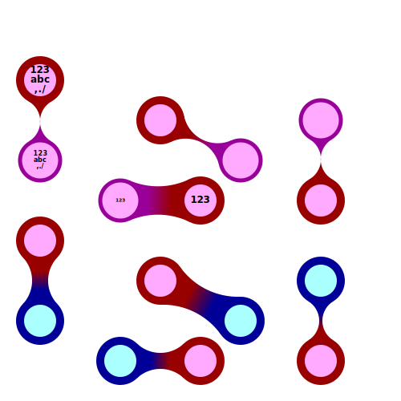

# bubbles
the ultimate bubble generator!!!

we know that you have been dreaming about generating bubble plots 
with a python code...

and now you can!

TODO:
* fstrings everywhere
* clear meaning of alpha and/or h
* don't die if bad alpha
* translate comments
* normal font choice
