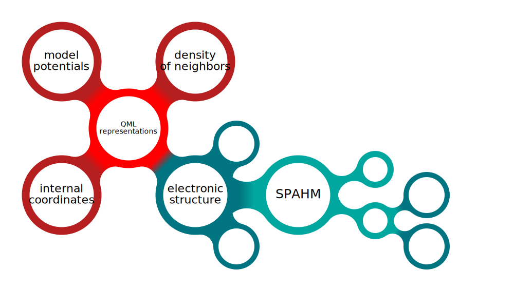

# bubbles
the ultimate bubble generator!!!

we know that you have been dreaming about generating bubble plots 
with a python code...

and now you can!




## Usage
...


## Examples
...


## Installation
```
pip install git+https://github.com/briling/bubbles.git
```

## TODO
* Good README
* Real package
* Templates
