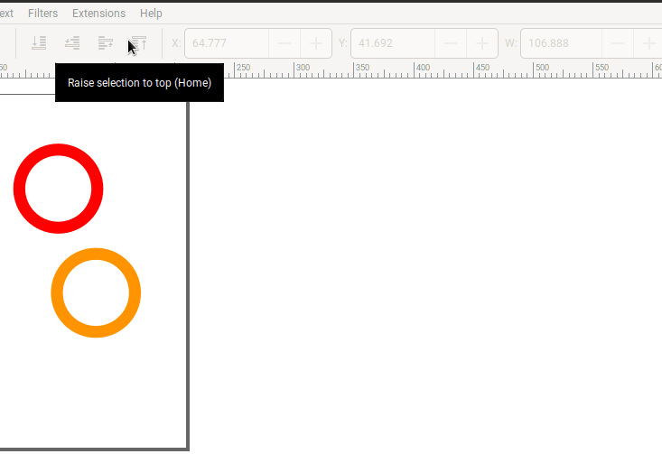

# Bubble bond inkscape extension

This is an [`inkscape`](https://inkscape.org/) extension 
that uses the [`bubbles`](../) library
to draw bonds between bubbles.

## Installation

Install the main `bubbles` package and put/link
`bubblebond.py` and `bubblebond.inx`
in `~/.config/inkscape/extensions/`
(or the directory listed at `Edit > Preferences > System: User extensions`).

## Usage

Select two bubbles you want to bond 
and use `Extensions > Bubble bond`. 

## TODO
* Fix the z-order
